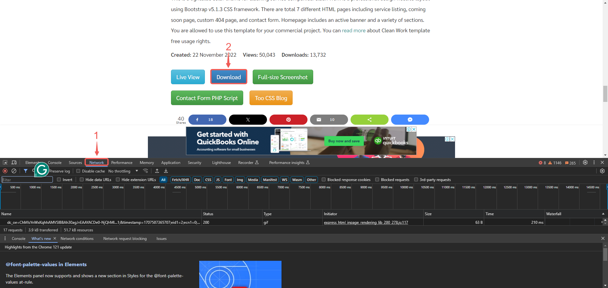
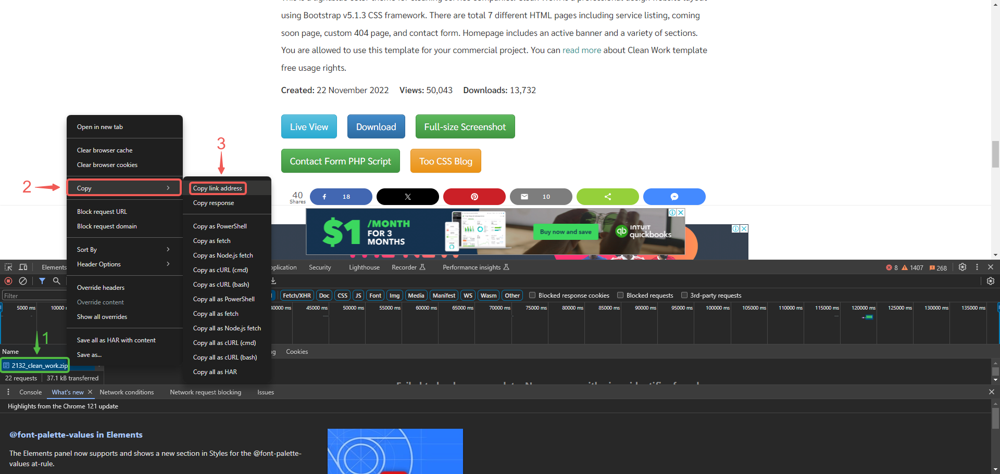

# Setup Multiple Static Websites on a Single Server Using Nginx Virtual Hosts

In this project, you will learn the concept of subdomains and hosting multiple websites on a single server using Nginx Virtual Host configuration.

|S/N | Project Tasks                                                                            |
|----|------------------------------------------------------------------------------------------|
| 1  |Install and configure Nignx on a server                                                   |
| 2  |Create two website directories with two different website templates.                      |
| 3  |Create two subdomains                                                                     |
| 4  |Add the IP of the server as A record to the two subdomains.                               |
| 5  |Configure the Virtual host to point two subdomains to two different website directories.  |
| 6  |Validate the setup by accessing the subdomains.                                              |
| 7  |Create a certbot SSL certificate for the root Domain.                        |
| 8  |Configure certbot on Nginx for two websites.                                         |
| 9  |Validate the subdomain websites’ SSL using OpenSSL utility.                               |

## Key Concepts Covered

- AWS (EC2 and Route 53)
- EC2
- Linux(Ubuntu)
- Nginx
- DNS
- **Subdomains**
- SSL (certbot)
- OpenSSL command

## Checklist

- [x] Task 1: Spin up a Ubuntu server & assign an elastic IP to it.
- [x] Task 2: SSH into the server and install and configure Nignx on a server.
- [x] Task 3: Create two website directories with two different website templates.
- [x] Task 4: Create two subdomains
- [x] Task 5: Add the IP of the server as A record to the two subdomains.
- [x] Task 6: Configure the Virtual host to point two subdomains to two different website directories.
- [x] Task 7: Validate the setup by accessing the subdomains.  
- [x] Task 8: Create a certbot SSL certificate for the root Domain.
- [x] Task 9: Configure certbot on Nginx for the two websites.
- [x] Task 10: Validate the subdomain websites’ SSL using OpenSSL utility.

## Documentation

- Spin up your ubuntu server, create an elastic IP and associate it to your instance.

### Install Nginx and Setup Your Website

- Execute the following commands.

`sudo apt update`

`sudo apt upgrade`

`sudo apt install nginx`

- Start your Nginx server by running the `sudo systemctl start nginx` command, enable it to start on boot by executing `sudo systemctl enable nginx`, and then confirm if it's running with the `sudo systemctl status nginx` command.

- Visit your instances IP address in a web browser to view the default Nginx startup page.

- Download your website template from your preferred website by navigating to the website, locating the template you want.

- Right click and select **Inspect** from the drop down menu.

- Click on the **Network** tab and then click **Download** button.

- Right click on the website name, select **Copy** and click on **Copy link address**.

- To install the unzip tool, run the following command: **`sudo apt install unzip`**.

- Execute the command to download and unzip your website files `sudo curl -o /var/www/html/2098_health.zip https://www.tooplate.com/zip-templates/2098_health.zip && sudo unzip -d /var/www/html/ /var/www/html/2098_health.zip && sudo rm -f /var/www/html/2098_health.zip`.

---
