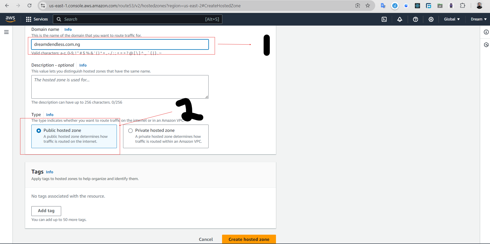

# Project 3


|S/N | Project Tasks                                                                                              |
|----|------------------------------------------------------------------------------------------------------------|
| 1  |Deploy three servers                                                                                        |
| 2  |Set up static websites on two servers using Nginx.                                                          |
| 3  |Use two separate HTML files with distinct content. Deploy one file to each server's index.html location.    |
| 4  |Set up Nginx on the third server. It will act as a load balancer.                                           |
| 5  |Configure Nginx to load and balance traffic between two static websites.                                    |
| 6  |Add the Nginx Load balancer IP to the DNS A record.                                                         |
| 7  |Try accessing the website. Every time you reload the website you should see a different index.html.         |


## Task 1 : Deploy three servers

I created 3 ubuntu server in my console namely: Mini, Barista and LoadBalancer by following steps:
- I logged into the my console (https://console.aws.amazon.com/console/home)
- Search for EC2 and clicked on Launch Instance
- Choose ubuntu server and also created a new key for each instances.
- I also create a new security group and click on all the checkbox
- After reviewing my options, I then clicked on Launch Instance
- Next, I went to my Elastic IP on my dashboard to make my IP address to be static for all 3 servers
- I created and associated all 3 server with the static IP address gotten
- Then, I connected to the 3 server via ssh using my command prompt


## Task 2 : Set up static website on two server using Nginx

- I downloaded your website template from your preferred website by navigating to the website, locating the template you want.

- Then, I right click and select **Inspect** from the drop down menu.
-  I click on the **Network** tab.
- Clicked on the download button to enable view my template zip file
- Right clicked and choose **Copy**, then choose **Copy URL** and pasted it on my notepad


- Then I went ahead to connect to my 2 servers via ssh on command prompt, to install Nginx, and execute the following commands on your terminal:

`sudo apt update`


`sudo apt upgrade`


`sudo apt install nginx`


- I started my nginx using these commands: 

`sudo systemctl start nginx` command to start my nginx.

`sudo systemctl enable nginx` command to enable it to start 
on boot by executing.

`sudo systemctl status nginx` command to confirm if it's running.


> [!NOTE]
Install Nginx on both web server terminals. These are the terminals you're using to manage the servers hosting the two distinct website contents that the load balancer will distribute traffic to.

- I visited my instances IP address in a web browser to view the default Nginx startup page.

- Execute `sudo apt install unzip` to install the unzip tool 


- I run the following command to download and unzip your website files `sudo curl -o /var/www/html/2135_mini_finance.zip https://www.tooplate.com/zip-templates/2135_mini_finance.zip && sudo unzip -d /var/www/html/ /var/www/html/2135_mini_finance.zip && sudo rm -f /var/www/html/2135_mini_finance.zip`.


 I set up my website's configuration, and started creating a new file in the Nginx sites-available directory. Use the following command to open a blank file in a text editor: `sudo nano /etc/nginx/sites-available/finance`.

- Copy and paste the following code into the open text editor.

```
server {
    listen 80;
    server_name example.com www.example.com;

    root /var/www/html/example.com;
    index index.html;

    location / {
        try_files $uri $uri/ =404;
    }
}
```


- I edited  the `root` directive within my server block to point to the directory where your downloaded website content is stored.
- I created a symbolic link for both websites by running the following command.
`sudo ln -s /etc/nginx/sites-available/finance /etc/nginx/sites-enabled/`


- Run the `sudo nginx -t` command to check the syntax of the Nginx configuration file, and when successful run the `sudo systemctl restart nginx` command.


- Then, I repeated the process for the second website.


> [!NOTE]
On your first server, run `sudo rm /etc/nginx/sites-enabled/default`, and on your second server, run `sudo rm /etc/nginx/sites-enabled/default`. This will delete the default site-enabled folders and enable Nginx to serve content from your specified website directories. If you don't delete these default folders, you'll continue to see the default Nginx page.


- Ran the `sudo systemctl restart nginx` command to restart my server.

- Checked both IP addresses to confirm your website is up and running.


### Configure your Load balancer

- Install Nginx on the server you want to use as a load balancer, and execute `sudo systemctl status nginx` to ensure it's running.

- Execute `sudo nano /etc/nginx/nginx.conf` to edit your Nginx configuration file.


- Add the following within the http block.

```

    upstream cloudghoul {
    server 1;
    server 2;
    # Add more servers as needed
}

server {
    listen 80;
    server_name <your domain> www.<your domain>;

    location / {
        proxy_pass http://cloudghoul;
    }
}

```


> [!NOTE]
Replace the necessary placeholders as shown in the picture above. Substitute `<server 1>` and `<server 2>` with the actual private IP addresses of your servers. Also, replace `<your domain> www.<your domain>` with your root domain and subdomain name, and update proxy_pass and the other relevant fields accordingly.

- Run `sudo nginx -t` to check for syntax error.


- Apply the changes by restarting Nginx:
`sudo systemctl restart nginx`

---

### Create An A Record

- I pointed my domain's A records to the IP address of my Nginx load balancer server.

- In route 53, select the domain name and click on **Create record**.

- Pasted my **IP address➀** and then click on **Create records➁** to create the root domain.

- Clicked on **create record** again, to create the record for my sub domain.

- Pasted my IP address➀, input the Record name(**www➁**) and then click on **Create records**➂.


- Go to the terminal you used in setting your first website and run `sudo nano /etc/nginx/sites-available/finance` to edit your settings. Enter the name of your domain and then save your settings.


- Restart your nginx server by running the `sudo systemctl restart nginx` command.

- Go to the terminal you used in setting your second website and run `sudo nano /etc/nginx/sites-available/finance` to edit your settings. Enter the name of your domain and then save your settings.


- Restart your nginx server by running the `sudo systemctl restart nginx` command.

- Go to your domain name in a web browser to verify that your website is accessible.

- Reload the webpage to ensure the load balancer distributes traffic evenly between your servers.




---

### Install certbot and Request For an SSL/TLS Certificate

- Install certbot by executing the following commands:
`sudo apt update`
`sudo apt install python3-certbot-nginx`

- Execute the `sudo certbot --nginx` command to request your certificate. Follow the instructions provided by certbot and select the domain name for which you would like to activate HTTPS.

- I got a congratulatory message that says https has been successfully enabled.


- Accessed my website to verify that Certbot has successfully enabled HTTPS.


- It is recommended to renew my LetsEncrypt certificate at least every 60 days or more frequently. I tested renewal command in dry-run mode:
`sudo certbot renew --dry-run`


---
---

#### The End Of Project 3

#### Thank you