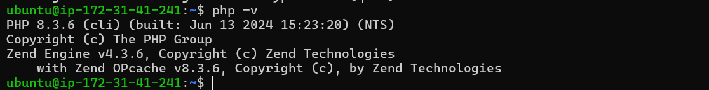
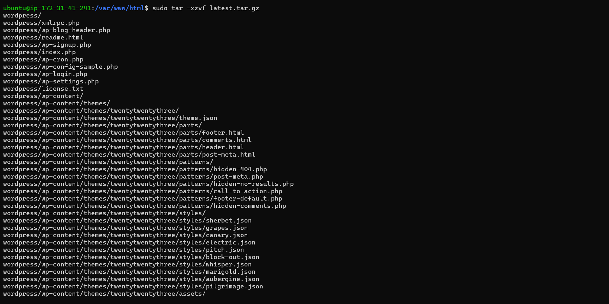
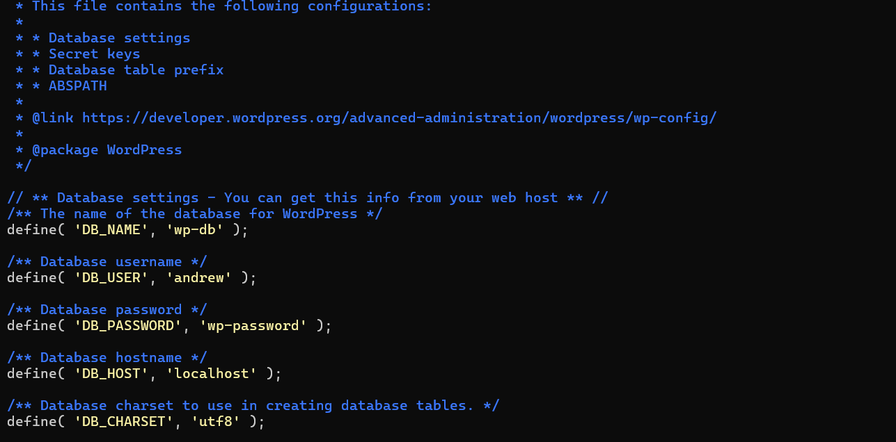
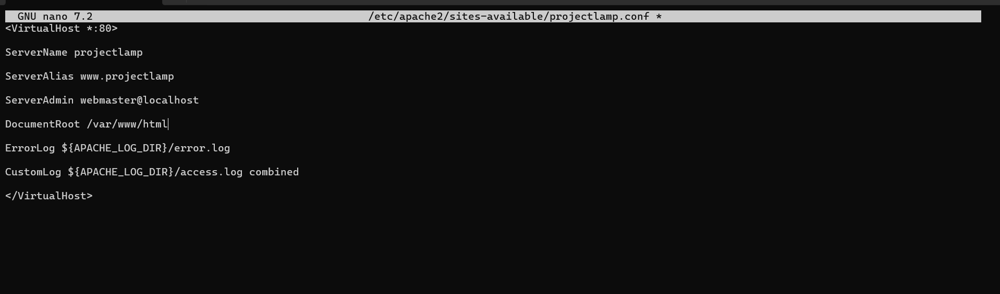
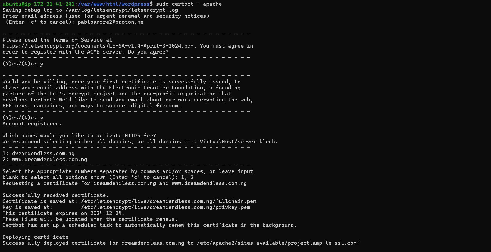

## Project 4

|S/N | Project Tasks                                                       |
|----|---------------------------------------------------------------------|
| 1  |Deploy an Ubuntu Server                                              |
| 2  |Set up your LAMP stack on the server                                 |
| 3  |Configure the wordpress Application                                  |
| 4  |Map the IP address to the DNS A record                               |
| 5  |Validate the WordPress website setup by accessing the web address.   |

### Creating an Ubuntu Server 

Firstly, I created and spin up an Ubuntu server, then allocated an Elastic IP for the server and associated the IP to my ubuntu server.
Then, I clicked on **Security①** and selected the **Security group②** to able me Set an inbound rule for MYSQL in your security group, also, Clicked on **Edit inbound rules**. And, click on **Add rule**.
Click on **Custom TCP**① and select **MySQL/Aurora**②.I entered my **IP address①** you want to allow access and click **Save rules②**.


### Install Apache

Secondly, I installed apache, by following this steps:
- I ran this command **`sudo apt update`**, followed by this command **`sudo apt install apache2`** and then, ran to enable Apache to start on boot, execute **`sudo systemctl enable apache2`①**, and then verify its status with the **`sudo systemctl status apache2`②** command.


Now, I want to confirm if my server is running both locally and via internet I ran this command: **`curl http://localhost:80`**. Then, I went ahead and copied my IP address and paste it on my browser to also confirm.


### Install MYSQL

I ran the command **`sudo apt install mysql-server`** to install MYSQL. When prompted, confirm the installation by typing 'Y' and then pressing ENTER.


- After the installation is complete, log in to the MySQL console by typing: **`sudo mysql`**.

- Run the following command to set the password for the root user with the MySQL native password authentication method: **`ALTER USER 'root'@'localhost' IDENTIFIED WITH mysql_native_password BY 'pass';`**. Exit the MySQL shell when you're done by typing **`exit`**.
- Start the interactive script by running: **`sudo mysql_secure_installation`①**. Answer **y**② for yes, or any other key to continue without enabling specific options.
- Set your **password validation policy level**.


> [!NOTE]
I set my password validation policy level to 0 because I don't require much security, as I will be terminating all resources immediately after this project. However, on the job, it's advised to use the strongest level, which is 2.

- Enable MySQL to start on boot by executing **`sudo systemctl enable mysql`①**, and then confirm its status with the **`sudo systemctl status mysql`②** command.


### Install PHP

- Install PHP along with required extensions by running the following script: **`sudo apt install php-curl php-gd php-mbstring php-xml php-xmlrpc php-soap php-intl php-zip`**.


**`sudo apt install php libapache2-mod-php php-mysql`**


- Confirm the downloaded PHP version by running **`php -v`**.



### Creating A Virtual Host For Your Website Using Apache

- Create the directory for Projectlamp using the 'mkdir' command as follows:
**`sudo mkdir /var/www/projectlamp`①** and assign ownership of the directory to my current system user using:
**`sudo chown -R $USER:$USER /var/www/projectlamp`②**.


- Create and open a new configuration file in Apache's sites-available directory using my preferred command-line editor:
**`sudo vi /etc/apache2/sites-available/projectlamp.conf`**.

- Creating this will produce a new blank file. Paste the configuration text provided below into it:

```
<VirtualHost *:80>

ServerName projectlamp

ServerAlias www.projectlamp

ServerAdmin webmaster@localhost

DocumentRoot /var/www/projectlamp

ErrorLog ${APACHE_LOG_DIR}/error.log

CustomLog ${APACHE_LOG_DIR}/access.log combined

</VirtualHost>
```

- Save your changes by pressing the **`Esc`** key, then type **`:wq`** and press **`Enter`**.


- Run the ls command **`sudo ls /etc/apache2/sites-available`①** to show the **new file②** in the sites-available directory.

- I can now enable the new virtual host using the a2ensite command: **`sudo a2ensite projectlamp`**.


- To disable Apache's default website, use the a2dissite command. Type: **`sudo a2dissite 000-default`**.


- To ensure my configuration file doesn’t contain syntax errors, run: **`sudo apache2ctl configtest`**. I saw **"Syntax OK"**.


- Finally run: **`sudo systemctl reload apache2`**. This will reload Apache for the changes to take effect.

> [!NOTE]
My new website is now active, but the web root **`/var/www/projectlamp`** is still empty. Let's create an **`index.html`** file in that location to test that the virtual host works as expected.

- To create the **index.html** file with the content **"Hello LAMP from Andrew Daraojimba"** in the /var/www/projectlamp directory, use the following command: **`sudo echo 'Hello LAMP from Andrew Daraojimba' > /var/www/projectlamp/index.html`**.

- Now, let's open my web browser and try to access my website using the IP address:

**`http://3.135.4.101:80`**


- Remove the index.html file by running the following command: **`sudo rm /var/www/projectlamp/index.html `**

### Enable PHP On The Website

With the default DirectoryIndex settings on Apache, a file named index.html will always take precedence over an index.php file. To change the precedence of index files (such as index.php over index.html) in Apache, I'll need to edit the dir.conf file. Here’s how I can do it:

- Edit the dir.conf file using a text editor (such as nano or vi): **`sudo nano /etc/apache2/mods-enabled/dir.conf`**


- Look for the DirectoryIndex directive within this file. It typically looks like this:

```
<IfModule mod_dir.c>
    DirectoryIndex index.html index.cgi index.pl index.php index.xhtml index.htm
</IfModule>
```

- To prioritize **index.php** over **index.html**, move **index.php** to the beginning of the list, like this:

```
<IfModule mod_dir.c>
    DirectoryIndex index.php index.html index.cgi index.pl index.xhtml index.htm
</IfModule>
```


- Press **`ctrl` + `x`①** on my keyboard to save and exit.

- Type **`y`②** to save the changes.

- When prompted to confirm the file name, simply press **`ENTER`③** to save the changes with the existing file name.

- Finally, reload Apache for the changes to take effect: **`sudo systemctl reload apache2`**.

Now, Apache will prioritize index.php over index.html when both files exist in the same directory.

- To create a new file named index.php inside your custom web root folder (/var/www/projectlamp), you can use the following command to open it in the nano text editor: **`nano /var/www/projectlamp/index.php`**.

- This will create a new file. Copy and paste the following PHP code into the new file:

```
<?php

phpinfo();
```

- Once I've saved and closed the file, go back to your web browser and refresh the page. 

### Install Wordpress

After setting up our LAMP environment, I can start installing WordPress. First, I'll download the WordPress installation files and place them in the default web server root directory: **/var/www/html**.

- Navigate to the directory using the cd command **`cd /var/www/html`**, and then download the WordPress installation files using the following command: **`sudo wget -c http://wordpress.org/latest.tar.gz`**


- Extract the files from the downloaded WordPress archive using the command: **`sudo tar -xzvf latest.tar.gz`**



- Run the command **`ls -l`** to confirm the existence of the **wordpress** directory in the current location (`/var/www/html`).


- Check the user running your web server with the command: **`ps aux | grep apache | grep -v grep`**.


*This command filters processes related to Apache (apache2 on Ubuntu) and displays information about the user running those processes.*

- Grant ownership of the WordPress directory and its files to the web server user **(www-data)** by running the command: **`sudo chown -R www-data:www-data /var/www/html/wordpress`**.

### Create a Database For Wordpress

- Access my MySQL root account with the following command: **`sudo mysql -u root -p`①**. Enter the **password②** I set earlier when prompted.

- To create a separate database named wp_db for WordPress to manage, execute the following command in the MySQL prompt: **`CREATE DATABASE wp_db;`**


- To access the new database, you can create a MySQL user account with a strong password using the following command:
**`CREATE USER andrew@localhost IDENTIFIED BY 'wp-password';`**


*Replace 'wp-password' with your preferred strong password for the MySQL user account.*

- To grant your created user (andrew@localhost) all privileges needed to work with the wp_db database in MySQL, use the following commands:

```
GRANT ALL PRIVILEGES ON wp_db.* TO andrew@localhost;
FLUSH PRIVILEGES;
```


> [!NOTE]
This grants all privileges **(ALL PRIVILEGES)** on all tables within the wp_db database **(`wp_db.*`)** to the user jay when accessing from localhost. The FLUSH PRIVILEGES command ensures that MySQL implements the changes immediately. Adjust the database name **(wp_db)** and username **(jay)** as per your setup.

- Type **`exit`** to exit the MySQL shell.


- Grant executable permissions recursively (-R) to the wordpress folder using the following command: **`sudo chmod -R 777 wordpress/`**


> [!NOTE]
This command sets read (r), write (w), and execute (x) permissions for the owner, group, and others on all files and directories within the wordpress folder. Using 777 permissions is quite permissive and may not be necessary for all files and folders; consider adjusting permissions based on security requirements.

- Change into the WordPress directory by running the command: **`cd wordpress`**.

So, I installed Wordpress and also created wordpress database, I update the database name, user nad password. Also, I changed the /var/www/projectlamp to /var/www/html. And I ran my IP address and I was able to create an account with Wordpress.




I created A records for my domain name and sub domain (www) linking them to my IP address. Then, Ensure that the server settings in your Apache configuration point to your domain name, and that the document root accurately points to your WordPress directory. Once you've made these adjustments, save the changes and exit the editor. Also, added my DNS setting to my server and updating my url using my domain name. Tested it with my domain name: dreamdendless.com.ng to check if everything is ok and also check my admin page if it is okay.


Then, I installed a certbot for my SSL/TLS Certificate to ensure that my website is secure and encrypted.



End of Project 4.
