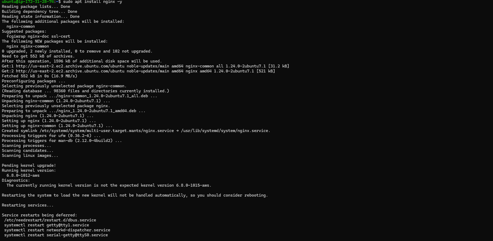

## Project 5

|S/N | Project Tasks                                      |
|----|----------------------------------------------------|
| 1  |Deploy 4 Ubuntu Server                              |
| 2  |Allow required ports in the security group          |
| 3  |Set up architecture                                 |
| 4  |Setup Consul Server                                 |
| 5  |Setup Backend Servers                               |
| 6  |Setup Load-Balancer                                 |
| 7  |Validate Service Discovery Setup                    |

## Checklist

-  Task 1: Deploy 4 Ubuntu Server
-  Task 2: Allow required ports in the security group
-  Task 3: Set up architecture
-  Task 4: Setup Consul Server
-  Task 5: Setup Backend Servers
-  Task 6: Setup Load-Balancer
-  Task 7: Validate Service Discovery Setup

I created 4 Ubuntu Server and allocated and associated withe Elastic IP addresses namely:
- BE1
- BE2
- Load-balancer
- Consul


- I allowed Required Ports In The Security Group to ensure the proper functioning of the Consul service, by opening the following ports in my security group and apply the same security group to all instances.

### Consul Servers

|S/N |Port Name  |Protocol      |Default Port   |
|----|-----------|--------------|---------------|
| 1  |DNS        |TCP and UDP   |8600           |
| 2  |HTTP API   |TCP           |8500           |
| 3  |HTTPS API  |TCP           |8501           |
| 4  |gRPC       |TCP           |8502           |
| 5  |gRPC TLS   |TCP           |8503           |
| 6  |Server RPC |TCP           |8300           |
| 7  |LAN Serf   |TCP and UDP   |8301           |
| 8  |WAN Serf   |TCP and UDP   |8302           |


- I login the Consul server and update the server then installed *Consul* in the server by executing the following command:
```
wget -O- https://apt.releases.hashicorp.com/gpg | gpg --dearmor | sudo tee /usr/share/keyrings/hashicorp-archive-keyring.gpg

echo "deb [signed-by=/usr/share/keyrings/hashicorp-archive-keyring.gpg] https://apt.releases.hashicorp.com $(lsb_release -cs) main" | sudo tee /etc/apt/sources.list.d/hashicorp.list

sudo apt update && sudo apt install consul
```


Then, I confirmed the version which I installed with *consul --version* command.


- All the Consul server configurations are located in the **`/etc/consul.d`** folder. To configure the Consul server, start by backing up the default configuration file **`consul.hcl`** by renaming it to **`consul.hcl.back`**, using the following command: **`sudo mv /etc/consul.d/consul.hcl /etc/consul.d/consul.hcl.back`**.
Then, I generated an **encrypted key** using the **`consul keygen`** command.- Create a new file named **`consul.hcl`** in the **`/etc/consul.d`** directory, using the following command: **`sudo vi /etc/consul.d/consul.hcl`**

- I added the following content to the **`consul.hcl`** file, I replaced **<YOUR_ENCRYPTED_KEY>** with the encrypted key I generated:

```
"bind_addr" = "0.0.0.0"
"client_addr" = "0.0.0.0"
"data_dir" = "/var/consul"
"encrypt" = "<YOUR_ENCRYPTED_KEY>"
"datacenter" = "dc1"
"ui" = true
"server" = true
"log_level" = "INFO"
```

Save this file after adding the content.

- I ran the following command to start the Consul server in the background: **`sudo nohup consul agent -dev -config-dir /etc/consul.d/ &`**.


- I checked the Consul server status by running the following command: **`sudo consul members`


- I visit 18.188.194.29:8500, I was able to access my Consul dashboard.


- To manage the Nginx backend servers more efficiently using service discovery, I will install both Nginx and the Consul agent on all backend servers. The Consul agent will act as a messenger, automatically registering both the server and the Nginx service with the Consul server, which serves as a central directory.

Here’s how I will start the process on each backend server:

1. SSH into the backend server.
2. Run `sudo apt-get update -y` to update the package information.
3. Run `sudo apt install nginx -y` to install Nginx.


After installing Nginx, navigate to the default HTML directory and modify the index.html file on both servers to differentiate them.

- Navigate to the HTML directory by executing the following command: **`cd /var/www/html`**.

- Open the HTML file with your preferred text editor to make edits: **`sudo vi index.html`**.

- Copy the HTML content below into the index.html file. On the second server, replace **SERVER-01** with **SERVER-02** in the HTML file to differentiate between the two backend servers.

```
<!DOCTYPE html>
<html>
<head>
	<title>aNDREW Backend Server </title>
</head>
<body>
	<h1>This is Backend SERVER-01</h1>
</body>
</html>
```
Install Consul as an agent on the servers. Run the following commands to install Consul:

```
wget -O- https://apt.releases.hashicorp.com/gpg | gpg --dearmor | sudo tee /usr/share/keyrings/hashicorp-archive-keyring.gpg

echo "deb [signed-by=/usr/share/keyrings/hashicorp-archive-keyring.gpg] https://apt.releases.hashicorp.com $(lsb_release -cs) main" | sudo tee /etc/apt/sources.list.d/hashicorp.list

sudo apt update && sudo apt install consul
```
- I checked the version of Consul *consul --version*.


- Replace the default Consul configuration file **`config.hcl`** located in **`/etc/consul.d`** with your custom **`consul.hcl`** file.

- Rename the default file and create a new one by running the following commands:

```
sudo mv /etc/consul.d/consul.hcl /etc/consul.d/consul.hcl.back
sudo vi /etc/consul.d/consul.hcl
```

- Add the following contents to the file. Replace **`<YOUR_ENCRYPTED_KEY>`①** with my encryption key. Also, replace **`34.201.77.72`②** with my Consul server's IP address.

```
"server" = false
"datacenter" = "dc1"
"data_dir" = "/var/consul"
"encrypt" = "<YOUR_ENCRYPTED_KEY>"
"log_level" = "INFO"
"enable_script_checks" = true
"enable_syslog" = true
"leave_on_terminate" = true
"start_join" = ["34.201.77.72"]
```

- Next, we need to create a **`backend.hcl`** configuration file in the **`/etc/consul.d`** directory to register the Nginx service and its health check URLs with the Consul server. This will enable the Consul server to continuously monitor the health of the Nginx service. Use the following command to create and edit the file: **`sudo vi /etc/consul.d/backend.hcl`**.

- Add the following contents to the **`backend.hcl`** file and save it.

```
"service" = {
  "Name" = "backend"
  "Port" = 80
  "check" = {
    "args" = ["curl", "localhost"]
    "interval" = "3s"
  }
}
```

This configuration registers your backend servers with the Consul server and sets up a health check that uses curl to test the service every 3 seconds.

- Verify the configurations by executing the following command: **`consul validate /etc/consul.d`**.

- Once all configurations are complete, start the Consul agent with the following command: **`sudo nohup consul agent -config-dir /etc/consul.d/ &`**.

- To verify if everything is working correctly, visit your Consul UI. If you see the backend listed in the UI as depicted below, it indicates that the backend has successfully registered itself with Consul.


## Setting Up my Load Balancer

Next, set up the load balancer to automatically update its backend server information based on the service registry maintained by Consul.
To retrieve the backend server details, we will use the **`consul-template`** binary. This tool interacts with the Consul server via API calls to fetch the backend server information. It then uses a template to substitute values and generate the **`loadbalancer.conf`** file, which is utilized by Nginx.

- Log in to the load-balancer server. Update the package information and install unzip with the following commands:

```
sudo apt-get update -y
sudo apt-get install unzip -y
```


- Install Nginx using the following command: **`sudo apt install nginx -y`**.



- Download the consul-template binary using the following command:

```
sudo curl -L  https://releases.hashicorp.com/consul-template/0.30.0/consul-template_0.30.0_linux_amd64.zip -o /opt/consul-template.zip

sudo unzip /opt/consul-template.zip -d  /usr/local/bin/
```


- To verify the installation of consul-template, check its version with the following command: **`consul-template --version`**.

- Create and edit a file named **`load-balancer.conf.ctmpl`** in the **`/etc/nginx/conf.d`** directory, using the following command: **`sudo vi /etc/nginx/conf.d/load-balancer.conf.ctmpl`**.

- Paste the following content into the file:

```
upstream backend {
 {{- range service "backend" }} 
  server {{ .Address }}:{{ .Port }}; 
 {{- end }} 
}

server {
   listen 80;

   location / {
      proxy_pass http://backend;
   }
}
```


- Create a file named **`consul-template.hcl`** in the **`/etc/nginx/conf.d/`** directory. This configuration file is used by **consul-template** to specify details about the Consul server IP and the destination path where the processed load-balancer.conf file will be saved.

Use the following command to create and edit the file: **`sudo vi /etc/nginx/conf.d/consul-template.hcl`**.

- Add the following content to the file, replacing **`<Consul Server IP>`** with your Consul server's IP address. This configuration specifies the Consul server details, the path to the template file, the destination for the rendered Nginx configuration, and the command to reload Nginx after updating the configuration.

```
consul {
 address = "<Consul Server IP>:8500"

 retry {
   enabled  = true
   attempts = 12
   backoff  = "250ms"
 }
}
template {
 source      = "/etc/nginx/conf.d/load-balancer.conf.ctmpl"
 destination = "/etc/nginx/conf.d/load-balancer.conf"
 perms       = 0600
 command = "service nginx reload"
}
```


- Delete the default server configuration to disable it by running the following command: **`sudo rm /etc/nginx/sites-enabled/default`**.


*The default server configuration file should be deleted to avoid inconsistencies with the server's settings.*

- Restart Nginx to apply the changes by running the following command: **`sudo systemctl restart nginx`**.

- Once configurations are complete, start the Consul Template agent using the following command. It continuously monitors Consul for changes.

```
sudo nohup consul-template -config=/etc/nginx/conf.d/consul-template.hcl &
```


- Upon completion, a load-balancer.conf file will be created with backend server information populated from the Consul service registry.


Now, if you access the load balancer IP in your web browser, it will display the custom HTML content from one of the backend servers. When you refresh the page, the load balancer will route your request to the other backend server, displaying its custom HTML content.


This behavior occurs because the load balancer uses a round-robin algorithm by default, distributing incoming requests evenly across all available backend servers.


### Service Discovery Test

Now that everything is set up and running, you can test the configuration by observing what happens when you stop one of your backend servers.


Stop one of the backend servers. The Consul server will monitor the health of each registered service. Once a backend server is stopped, Consul will detect the server's unavailability and mark it as unhealthy. The health check for that server will fail, and it will be removed from the load balancer's active pool of servers.

As a result, the load balancer will only direct traffic to the remaining healthy backend servers. This ensures that your application continues to run smoothly without any disruption to users, demonstrating the effectiveness of your service discovery and health check configuration with Consul and Nginx.

**Service Check:** These checks are specific to the services running on the nodes (in this case, Nginx). When you stopped Nginx, the service check that monitors the health of Nginx on that particular node would fail, leading to the "all service checks failed" error.

**Node checks:** These checks monitor the overall health of the node itself, which includes the underlying operating system and possibly other metrics (like CPU, memory, and disk usage). Since stopping Nginx does not necessarily mean the node is unhealthy (the node could still be up and running, responding to pings, etc.), the node checks would still pass.


